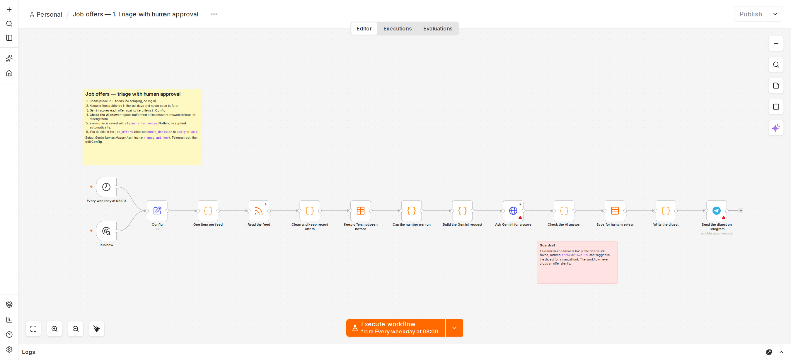

# Tri des offres d'emploi avec validation humaine

[English](README.md) · **Français**

Chaque matin de semaine, cette automatisation :

1. Lit des flux publics d'offres d'emploi (RSS, sans extraction de pages web, sans connexion).
2. Garde les offres des derniers jours qu'elle n'a encore jamais vues et qui citent l'un de vos **mots-clés**. Ce filtre gratuit passe avant tout appel à l'IA : les offres hors sujet ne consomment donc jamais votre quota Gemini.
3. Demande à Gemini de noter chaque offre de 0 à 100 selon **vos critères écrits**.
4. Rejette toute réponse de l'IA mal formée ou incohérente, par exemple un verdict "apply" (postuler) avec une note de 20.
5. Enregistre chaque offre dans une table de données n8n, avec `status = to_review`.
6. Vous envoie **un seul** message Telegram avec les offres classées par note.

**Elle ne postule jamais à rien.** C'est vous qui décidez dans la table, et chaque lundi un rapport vous dit si le classement de l'IA correspond toujours à vos décisions.

## Workflows

| Fichier | Rôle |
|---|---|
| `workflows/0-create-table.json` | Crée la table de données `job_offers`. À lancer une seule fois. |
| `workflows/1-triage.json` | Le tri quotidien. |
| `workflows/2-weekly-report.json` | Rapport du lundi : accord entre l'IA et vous, bonnes offres manquées par l'IA, règle d'arrêt. |

## Configuration (environ 15 minutes)

La version détaillée, clic par clic, se trouve dans [SETUP.fr.md](../SETUP.fr.md) (étapes 3 à 8).

1. **Importez** les workflows (voir le README principal), puis ouvrez http://localhost:5678.
2. **Clé Gemini.** Créez une clé gratuite sur https://aistudio.google.com/apikey. Dans n8n, allez dans *Credentials → Create credential → Header Auth* (identifiants → créer un identifiant → authentification par en-tête), mettez `x-goog-api-key` dans **Name** et votre clé dans **Value**, puis enregistrez-le sous le nom `Gemini API key`.
3. **Bot Telegram.**
   - Écrivez à [@BotFather](https://t.me/BotFather), envoyez `/newbot` et copiez le jeton.
   - Dans n8n, allez dans *Credentials → Telegram API* et collez le jeton.
   - Envoyez **d'abord** un message quelconque à votre nouveau bot, puis ouvrez `https://api.telegram.org/bot<TOKEN>/getUpdates` dans votre navigateur. Le nombre après `"chat":{"id":` est votre identifiant de discussion (chat id). Si vous ne voyez que `[]`, envoyez un autre message au bot et rechargez la page. L'identifiant d'un groupe commence par `-`.
4. **Ouvrez `0. Create the table`** et cliquez une fois sur *Execute workflow* (exécuter le workflow).
5. **Ouvrez `1. Triage`** :
   - sélectionnez les deux identifiants dans **Ask Gemini for a score** (demander une note à Gemini) et **Send the digest on Telegram** (envoyer le résumé sur Telegram) ;
   - ouvrez **Config** et renseignez `telegram_chat_id`, vos `criteria` et les `feeds` que vous voulez ;
   - vérifiez que `model` figure toujours sur https://ai.google.dev/gemini-api/docs/models.
6. Cliquez sur *Execute workflow* pour le tester, puis cliquez sur **Publish** (publier ; en haut à droite dans n8n 2.x, les versions plus anciennes ont un interrupteur *Active*) pour que la planification tourne.
7. **Ouvrez `2. Weekly report`** : sélectionnez l'identifiant Telegram, renseignez aussi `telegram_chat_id` dans son propre **Config**, puis publiez-le.

## Votre rôle : décider

Ouvrez **Data tables → job_offers** dans n8n. Pour chaque offre que vous avez regardée, mettez `human_decision` à `apply` ou `skip`.

Ce sont ces décisions que le rapport hebdomadaire mesure. Sans elles, le rapport reste sur "too early to judge" (trop tôt pour juger).

## Réglages dans Config

| Réglage | Par défaut | Pourquoi |
|---|---|---|
| `max_offers_per_run` | 15 | Protège le quota gratuit de Gemini. Les offres au-delà de la limite sont notées à l'exécution suivante, si elles sont toujours dans la limite de `max_age_days`. |
| `max_age_days` | 3 | Les offres plus anciennes sont ignorées. |
| `keywords` | python, django, fastapi, backend, api, llm… | Une offre doit citer au moins l'un d'eux, dans son titre ou son texte. Laissez la liste vide pour tout envoyer à Gemini. |
| `feeds` | We Work Remotely (back end), Himalayas | Tout flux RSS d'offres d'emploi fonctionne. |
| `criteria` | un profil d'exemple | La seule chose que Gemini sait de vous. Soyez concret. |

Dans le rapport hebdomadaire : `window_days` (28) limite le jugement aux offres récentes, pour qu'une dérive récente ne soit pas cachée par d'anciens résultats. `min_decisions` (20) est le nombre de décisions nécessaires avant de juger l'IA. `min_agreement` (0.7) est le seuil sous lequel le rapport affiche **PAUSE**.

**Comment l'accord est compté.** Il y a accord quand vous avez postulé et que l'IA a dit `apply` ou `discuss`, ou quand vous avez ignoré l'offre et que l'IA a dit `skip`. Un `discuss` sur une offre que vous ignorez compte comme un désaccord. Les bonnes offres que l'IA vous a dit d'ignorer sont comptées à part, car ce sont les erreurs les plus coûteuses.

## Garde-fous de ce workflow

- L'IA n'agit jamais. Elle remplit `ai_score`, `ai_verdict` et `ai_reasons`, et la colonne `human_decision` est à vous.
- **Check the AI answer** (vérifier la réponse de l'IA) rejette le JSON mal formé ou vide, les notes hors de 0–100, les verdicts hors des tranches de notes données dans le prompt (apply 70+, discuss 50–69, skip sous 50), les valeurs inconnues et les réponses sans justification. L'offre est gardée avec le statut `invalid` et listée sous "need a manual look" (à vérifier à la main).
- Si Gemini est en panne ou a dépassé son quota, l'offre est gardée avec le statut `error`, pas écartée.
- Un flux en échec n'arrête pas l'exécution.
- Les appels partent un toutes les 5 secondes, avec une limite par exécution, pour rester dans l'offre gratuite.
- Rien n'est envoyé quand il n'y a rien de nouveau.

## Limites

- Le classement ne vaut que ce que vaut le texte des `criteria`. Le rapport hebdomadaire est là pour vous dire quand il n'est pas assez bon.
- Les offres marquées `error` ne sont pas notées à nouveau automatiquement. Regardez-les vous-même.
- Les flux changent. Si l'un d'eux ne renvoie rien pendant une semaine, vérifiez son URL.
