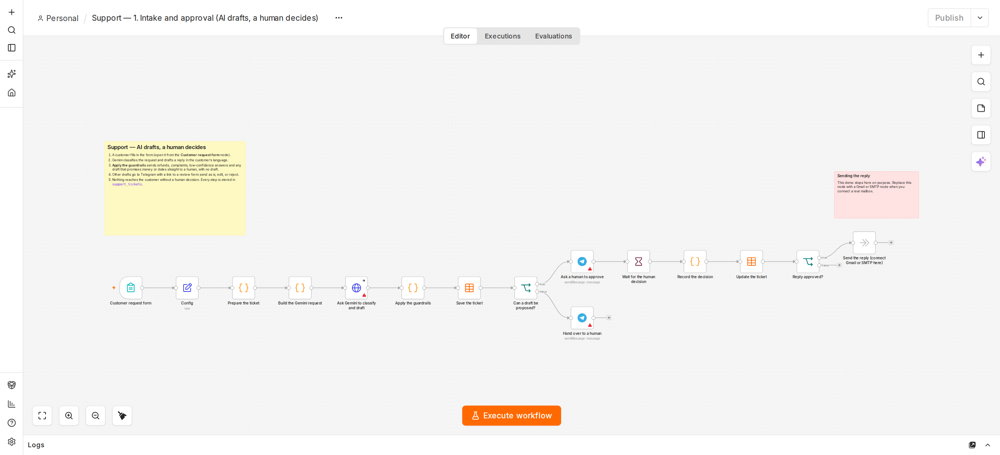

# Assistant support : l'IA rédige, un humain décide

[English](README.md) · **Français**

Un client remplit un formulaire de contact. Gemini classe la demande et rédige un brouillon de réponse. Ensuite, les garde-fous décident qui traite la demande :

| Cas | Ce qui se passe |
|---|---|
| Remboursement ou réclamation | **Va à une personne, sans brouillon.** Ces cas sont toujours humains. |
| L'IA n'est pas assez sûre d'elle (sous `min_confidence`) | Va à une personne, sans brouillon. |
| Le brouillon parle d'argent, de remise, de garantie ou de date de livraison | Va à une personne, sans brouillon. L'IA ne doit pas faire de promesses. |
| Gemini échoue ou répond mal | Va à une personne. Une personne est toujours prévenue. |
| Brouillons suspendus (`drafting_enabled = false`) | Tout va à une personne. |
| Tout le reste | Le brouillon est envoyé sur Telegram avec un lien vers un **formulaire de relecture**. |

Le formulaire de relecture propose trois choix : **send as is** (envoyer tel quel), **send my edited version** (envoyer ma version modifiée) ou **reject** (rejeter). Votre choix est enregistré, et rien n'arrive au client sans ce choix. Un brouillon resté sans réponse pendant 48 heures expire et n'est pas envoyé.

## Workflows

| Fichier | Rôle |
|---|---|
| `workflows/0-create-table.json` | Crée la table de données `support_tickets`. À lancer une seule fois. |
| `workflows/1-intake-and-approval.json` | `1. Intake and approval` : formulaire, puis IA, puis garde-fous, puis relecture humaine. |
| `workflows/2-weekly-report.json` | Rapport du lundi : brouillons envoyés tels quels, modifiés ou rejetés, temps de décision, règle d'arrêt. |

## Configuration

1. Créez les deux mêmes identifiants que pour le tri des offres d'emploi : `Gemini API key` (Header Auth, nom `x-goog-api-key`) et votre bot Telegram.
2. Lancez `0. Create the table` une seule fois.
3. Dans `1. Intake and approval` :
   - sélectionnez les identifiants dans le nœud Gemini et dans les deux nœuds Telegram ;
   - dans **Config**, renseignez `telegram_chat_id`, `company_name` et, si besoin, `min_confidence` ;
   - puis cliquez sur **Publish** (publier, en haut à droite).
4. Ouvrez le formulaire : cliquez sur le nœud **Customer request form** (formulaire de demande client) et copiez son *production URL* (URL de production) (`http://localhost:5678/form/support`).
5. Dans `2. Weekly report`, sélectionnez l'identifiant Telegram, renseignez le chat id dans son **Config**, puis publiez-le.

**Le lien de relecture ne fonctionne que sur l'ordinateur qui fait tourner n8n,** et il fonctionne comme un mot de passe : toute personne qui l'a peut valider la réponse. Ne le transférez pas. Il pointe vers `localhost` : ouvrez-le donc dans Telegram Desktop sur cet ordinateur. Pour relire depuis un téléphone, n8n doit être accessible depuis internet, par exemple avec un n8n hébergé ou un tunnel. Ne le faites qu'après avoir mis en place une vraie authentification.

## Envoyer la vraie réponse

Le dernier nœud, **Send the reply (connect Gmail or SMTP here)** (envoyer la réponse, brancher Gmail ou SMTP ici), ne fait rien, volontairement. Remplacez-le par un nœud Gmail ou SMTP quand vous connectez une vraie boîte mail. Il reçoit `customer_email` et `final_reply`.

## Ce que mesure le rapport hebdomadaire

- La part des demandes traitées uniquement par une personne (en pourcentage).
- Pour les brouillons : combien ont été envoyés tels quels, modifiés, rejetés ou ont expiré.
- Le temps médian jusqu'à une décision humaine.
- Les demandes par catégorie.

Seuls les `window_days` derniers jours (28 par défaut) comptent, pour qu'une dérive récente ne soit pas cachée par d'anciens résultats.

**Règle d'arrêt.** Après `min_decisions` décisions (20 par défaut), si plus de `max_reject_rate` des brouillons sont rejetés (30 % par défaut), le rapport affiche **PAUSE DRAFTING** (suspendre les brouillons). Vous mettez alors `drafting_enabled` à `false` dans le **Config** du workflow de réception, ce qui envoie toutes les demandes à une personne, et vous corrigez le prompt.

## Limites

- La liste des mots à risque couvre l'anglais et le français. Ajoutez les vôtres pour d'autres langues.
- Les catégories et le niveau d'urgence viennent de l'IA. Ils aident à trier les demandes, mais une personne lit quand même chacune d'elles.
- Il s'agit d'une boutique de démonstration. Avant de l'utiliser avec de vrais clients, lisez la partie *Confidentialité* ci-dessous.

## Confidentialité

- Les noms, e-mails et messages des clients sont envoyés à Gemini et à Telegram. Avec l'offre gratuite de Gemini, Google peut utiliser les prompts pour améliorer ses produits. **Pour de vrais clients, utilisez une offre payante et informez les clients dans votre politique de confidentialité.**
- Les tickets restent dans la table `support_tickets`, et n8n garde aussi les journaux d'exécution. Décidez combien de temps vous les gardez, et supprimez régulièrement les anciennes lignes et exécutions (n8n : nettoyage dans *Settings → Executions*).
- Le formulaire n'a pas de limite de fréquence. Gardez n8n sur `localhost` ou derrière une authentification, sinon toute personne qui trouve le formulaire pourrait épuiser votre quota Gemini.
