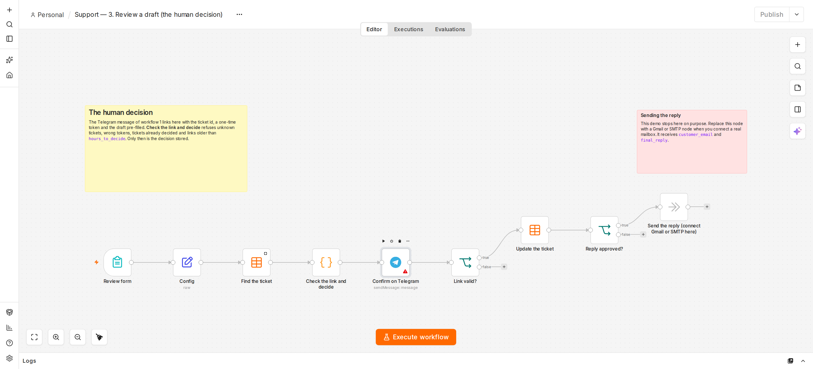

# Support assistant: AI drafts, a human decides

**English** · [Français](README.fr.md)

A customer fills in a contact form. Gemini classifies the request and drafts a reply. Then the guardrails decide who handles the request:

| Case | What happens |
|---|---|
| Refund or complaint | **Goes to a person, with no draft.** These are always human. |
| AI not confident enough (below `min_confidence`) | Goes to a person, with no draft. |
| The draft mentions money, a discount, a guarantee or a delivery date | Goes to a person, with no draft. The AI must not make promises. |
| Gemini fails or answers badly | Goes to a person. A person is always notified. |
| Drafting paused (`drafting_enabled = false`) | Everything goes to a person. |
| Anything else | The draft is sent to Telegram with a one-time link to a **review form**, pre-filled with the draft. |

In the review form you edit the reply if needed, then choose **Send this reply** or **Reject**. Whatever you choose is recorded, and nothing reaches the customer without that choice. The customer only ever sees a thank-you page.

The review link carries a one-time token. It is refused if the token is wrong, if the ticket was already decided, or if it is older than 48 hours (`hours_to_decide`).

## Workflows

| File | Purpose |
|---|---|
| `workflows/0-create-table.json` | Creates the `support_tickets` data table. Run it once. |
| `workflows/1-intake-and-approval.json` | `1. Intake`: customer form, then AI, then guardrails, then Telegram. |
| `workflows/2-weekly-report.json` | Monday report: drafts sent as is, edited or rejected, time to decide, kill switch. |
| `workflows/3-review-a-draft.json` | `3. Review a draft`: the form a person opens from Telegram; checks the link and records the decision. |

## Setup

The detailed, click-by-click version is in [SETUP.md](../SETUP.md) (step 9).

1. Create the same two credentials as for the job offer triage: `Gemini API key` (Header Auth, name `x-goog-api-key`) and your Telegram bot.
2. Run `0. Create the table` once.
3. In `1. Intake`:
   - select the credentials in the Gemini node and in both Telegram nodes;
   - in **Config**, set `telegram_chat_id`, `company_name` and, if needed, `min_confidence`;
   - then click **Publish** (top right).
4. In `3. Review a draft`: select the Telegram credential, set `telegram_chat_id` in **Config**, then **Publish**.
5. The customer form is at `http://localhost:5678/form/support`.
6. In `2. Weekly report`, select the Telegram credential, set the chat id in its **Config**, then publish it.

**The review link only works on the computer that runs n8n,** and it acts like a password: whoever has it can decide on that ticket, once. Do not forward it. It points to `localhost`, so open it in Telegram Desktop on that computer. To review from a phone, n8n must be reachable from the internet, for example with a hosted n8n or a tunnel. Only do that after setting up proper authentication.

## Sending the real reply

The last node of `3. Review a draft`, **Send the reply (connect Gmail or SMTP here)**, does nothing, on purpose. Replace it with a Gmail or SMTP node when you connect a real mailbox. It receives `customer_email` and `final_reply`.

## What the weekly report measures

- The share of requests handled by a person only (as a percentage).
- For drafts: how many were sent as is, edited, rejected, or expired (no decision within `hours_to_decide`).
- The median time to a human decision.
- The requests by category.

Only the last `window_days` (28 by default) count, so a recent drift is not hidden by old results.

**Kill switch.** After `min_decisions` decisions (20 by default), if more than `max_reject_rate` of the drafts are rejected (30% by default), the report says **PAUSE DRAFTING**. You then set `drafting_enabled` to `false` in the intake workflow's **Config**, which sends every request to a person, and you fix the prompt.

## Limits

- The list of risky words covers English and French. Add your own for other languages.
- Categories and urgency come from the AI. They help sort requests, but a person still reads every one.
- This is a demo shop. Before using it with real customers, see *Privacy* below.

## Privacy

- Customer names, emails and messages are sent to Gemini and to Telegram. On Gemini's free tier, Google may use prompts to improve its products. **For real customers, use a paid tier and tell customers in your privacy notice.**
- Tickets stay in the `support_tickets` table, and n8n also keeps execution logs. Decide how long you keep them, and delete old rows and executions regularly (n8n: *Settings → Executions* pruning).
- The form has no rate limit. Keep n8n on `localhost` or behind authentication, or anyone who finds the form could use up your Gemini quota.
